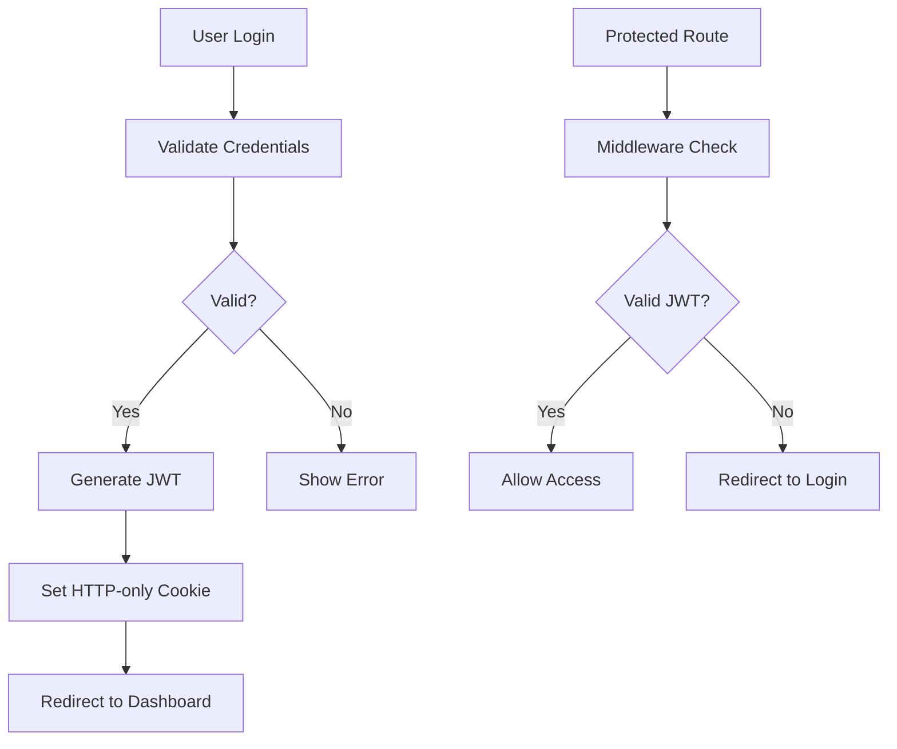

# Project Structure 📁

Understanding the DevMarket codebase organization and architecture.

## 🏗️ Directory Structure

```
digitalmarketplace/
├── src/                          # Source code
│   ├── app/                      # Next.js App Router
│   │   ├── api/                  # API routes
│   │   │   ├── auth/             # Authentication endpoints
│   │   │   │   ├── login/        # POST /api/auth/login
│   │   │   │   ├── logout/       # POST /api/auth/logout
│   │   │   │   ├── signup/       # POST /api/auth/signup
│   │   │   │   └── me/           # GET /api/auth/me
│   │   │   ├── guilds/           # Guild management
│   │   │   ├── db-test/          # Database connectivity test
│   │   │   └── migrate/          # Database migrations
│   │   ├── dashboard/            # Protected dashboard page
│   │   ├── login/                # Login page
│   │   ├── signup/               # Registration page
│   │   ├── globals.css           # Global styles
│   │   ├── layout.jsx            # Root layout component
│   │   └── page.jsx              # Homepage
│   ├── components/               # Reusable UI components
│   │   ├── hero.jsx              # Landing page hero section
│   │   └── pagecontext.js        # Page context provider
│   ├── constants/                # Application constants
│   │   └── index.mjs             # Centralized configuration
│   ├── lib/                      # Core utilities and libraries
│   │   ├── auth.js               # Authentication utilities
│   │   ├── db.js                 # Database connection and utilities
│   │   ├── index.js              # Unified exports
│   │   ├── models/               # Data models
│   │   │   └── User.js           # User model
│   │   └── utils/                # Utility functions
│   │       └── validation.js     # Input validation
│   └── middleware.js             # Next.js middleware for auth
├── public/                       # Static assets
│   ├── discord-icon.svg          # Social provider icons
│   ├── github-icon.svg
│   ├── google-icon-logo.svg
│   └── ...                       # Other static files
├── wiki/                         # Documentation (this wiki)
├── DocumentationFiles/           # Additional documentation
├── .env.example                  # Environment template
├── .env.local                    # Local environment (git-ignored)
├── .gitignore                    # Git ignore rules
├── eslint.config.mjs             # ESLint configuration
├── jsconfig.json                 # JavaScript configuration
├── next.config.js                # Next.js configuration
├── package.json                  # Dependencies and scripts
├── postcss.config.mjs            # PostCSS configuration
├── README.md                     # Project overview
├── SECURITY.md                   # Security guidelines
└── tailwind.config.js            # Tailwind CSS configuration
```

## 📦 Core Modules

### Authentication System (`src/lib/auth.js`)
Centralized authentication utilities:

```javascript
// Password hashing and verification
export async function hashPassword(password)
export async function verifyPassword(password, hashedPassword)

// JWT token management
export function generateToken(user)
export function verifyToken(token)

// Cookie management
export async function setAuthCookie(token)
export async function removeAuthCookie()

// User session
export async function getUser()

// Role-based access control
export function hasRole(user, requiredRole)
```

### Database Layer (`src/lib/db.js`)
Database connection and query utilities:

```javascript
// Connection pool management
export const pool

// Query utilities
export async function query(text, params)
export async function getClient()
export async function testConnection()

// Migration system
export async function runMigrations()
```

### User Model (`src/lib/models/User.js`)
User data access layer:

```javascript
export class User {
  static async create(userData)
  static async findByEmail(email)
  static async findById(id)
  static async update(id, userData)
  static async delete(id)
}
```

### Validation (`src/lib/utils/validation.js`)
Input validation utilities:

```javascript
export function validateSignupForm(data)
export function validateLoginForm(data)
export function validateEmail(email)
export function validatePassword(password)
```

## 🎯 Architecture Patterns

### Next.js App Router
Using the modern App Router for better organization:

```
src/app/
├── layout.jsx          # Root layout (wraps all pages)
├── page.jsx            # Homepage (/)
├── login/page.jsx      # Login page (/login)
├── signup/page.jsx     # Registration page (/signup)
├── dashboard/page.jsx  # Protected dashboard (/dashboard)
└── api/                # API routes
    ├── auth/           # Authentication endpoints
    └── guilds/         # Guild management
```

### API Route Structure
RESTful API design with consistent patterns:

```
/api/auth/signup   POST   - Create new user account
/api/auth/login    POST   - Authenticate user
/api/auth/logout   POST   - Destroy user session
/api/auth/me       GET    - Get current user info
/api/guilds        GET    - List guilds (placeholder)
/api/migrate       POST   - Run database migrations
/api/db-test       GET    - Test database connectivity
```

### Middleware Architecture
Request processing pipeline:

```javascript
// src/middleware.js
export function middleware(request) {
  // 1. Check if route is protected
  // 2. Verify JWT token
  // 3. Check user permissions
  // 4. Allow/deny access
  // 5. Redirect if unauthorized
}
```

## 🔧 Configuration Management

### Centralized Constants (`src/constants/index.mjs`)
All configuration in one place:

```javascript
export const APP_CONFIG = {
  name: "DevMarket",
  description: "Monetize your code and earn passive income",
  url: process.env.NEXT_PUBLIC_APP_URL
}

export const AUTH_CONFIG = {
  jwtSecret: process.env.JWT_SECRET,
  cookieName: 'auth-token',
  cookieMaxAge: 7 * 24 * 60 * 60 * 1000
}

export const DB_CONFIG = {
  host: process.env.DB_HOST,
  port: parseInt(process.env.DB_PORT),
  database: process.env.DB_NAME
}

export const ROUTES = {
  public: { home: '/', login: '/login' },
  protected: { dashboard: '/dashboard' },
  api: { auth: '/api/auth', guilds: '/api/guilds' }
}
```

### Environment Configuration
Environment-specific settings:

```env
# Development (.env.local)
NEXT_PUBLIC_APP_URL=http://localhost:3000
JWT_SECRET=development-secret
DB_PASSWORD=dev-password

# Production (Platform environment variables)
NEXT_PUBLIC_APP_URL=https://your-domain.com
JWT_SECRET=<secure-production-secret>
DB_PASSWORD=<secure-production-password>
```

## 🎨 Frontend Architecture

### Component Structure
```
src/components/
├── hero.jsx           # Landing page hero section
│   ├── Header         # Navigation and branding
│   ├── Hero           # Main call-to-action
│   ├── Features       # Feature showcase
│   ├── Testimonials   # User testimonials
│   └── Footer         # Site footer
└── pagecontext.js     # React context for page state
```

### Styling Architecture
Using Tailwind CSS with custom utilities:

```css
/* globals.css */
@tailwind base;
@tailwind components;
@tailwind utilities;

/* Custom component classes */
@layer components {
  .btn-primary {
    @apply bg-blue-600 text-white px-4 py-2 rounded hover:bg-blue-700;
  }
}
```

## 🗄️ Data Flow

### Authentication Flow


### Data Access Pattern
```javascript
// 1. API Route receives request
// 2. Validate input using validation utilities
// 3. Use model classes for database operations
// 4. Return standardized response

// Example:
export async function POST(request) {
  // 1. Parse and validate input
  const { email, password } = await request.json()
  const validation = validateLoginForm({ email, password })
  
  // 2. Database operation via model
  const user = await User.findByEmail(email)
  
  // 3. Business logic
  const isValid = await verifyPassword(password, user.password)
  
  // 4. Response
  return NextResponse.json({ success: true, data: { user } })
}
```

## 📝 Naming Conventions

### Files and Directories
- **Pages**: `kebab-case` (e.g., `user-profile/page.jsx`)
- **Components**: `PascalCase` files, `camelCase` functions
- **Utilities**: `camelCase` (e.g., `validateEmail`)
- **Constants**: `UPPER_SNAKE_CASE` (e.g., `AUTH_CONFIG`)

### Code Style
```javascript
// Constants
export const API_ENDPOINTS = {
  AUTH: '/api/auth',
  USERS: '/api/users'
}

// Functions
export async function getUserById(id) {
  return await User.findById(id)
}

// Components
export default function UserProfile({ user }) {
  return <div>{user.name}</div>
}

// Classes
export class UserService {
  async createUser(userData) {
    return await User.create(userData)
  }
}
```

## 🔗 Module Dependencies

### Import Paths
Using absolute imports for cleaner code:

```javascript
// ✅ Good - Absolute imports
import { AUTH_CONFIG } from '@/constants/index.mjs'
import { User } from '@/lib/models/User'
import { validateEmail } from '@/lib/utils/validation'

// ❌ Avoid - Relative imports for cross-directory
import { AUTH_CONFIG } from '../../../constants/index.mjs'
```

### Dependency Graph
```
Pages/Components
    ↓
Constants & Config
    ↓
Utilities & Models
    ↓
Database Layer
```

## 🧪 Testing Structure

### Test Organization
```
__tests__/
├── api/
│   ├── auth.test.js          # API endpoint tests
│   └── guilds.test.js
├── components/
│   ├── hero.test.jsx         # Component tests
│   └── layout.test.jsx
├── lib/
│   ├── auth.test.js          # Utility function tests
│   ├── db.test.js
│   └── validation.test.js
└── setup.js                  # Test configuration
```

## 📚 Documentation Structure

### Wiki Organization
- **Home** - Project overview and quick links
- **Quick Start** - Get running in 5 minutes
- **API Documentation** - Complete API reference
- **Security** - Security features and best practices
- **Deployment** - Production deployment guide
- **Development** - Contributing and development workflow

---

**🔗 Related Pages:**
- [API Documentation](API-Documentation) - Complete API reference
- [Authentication System](Authentication-System) - Auth implementation details
- [Development Workflow](Development-Workflow) - Contributing guidelines
