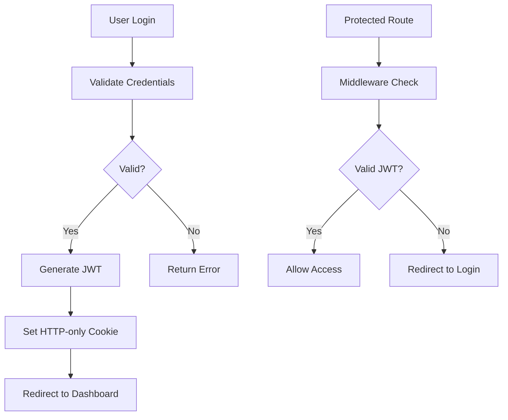

# Security Overview 🔐

DevMarket implements enterprise-level security practices to protect user data and ensure secure operations.

## 🛡️ Security Features

### Authentication & Authorization
- **JWT-based Authentication** with HTTP-only cookies
- **Role-based Access Control** (RBAC) with hierarchical permissions
- **Secure password hashing** using bcrypt with 12 salt rounds
- **Session management** with automatic expiration

### Data Protection
- **SQL Injection Prevention** through parameterized queries
- **XSS Protection** via HTTP-only cookies and input sanitization
- **Environment Variable Validation** prevents deployment with missing secrets
- **No hardcoded credentials** anywhere in the codebase

### Infrastructure Security
- **Secure cookie configuration** with proper flags
- **Database connection pooling** with SSL support
- **Middleware-based route protection**
- **Comprehensive error handling** without data leakage

## 🔒 Security Architecture

### Authentication Flow



### Role Hierarchy

```
Admin (Level 3)
  ├── Can manage all users
  ├── Can access all resources
  └── Can modify system settings
  
Moderator (Level 2)
  ├── Can manage regular users
  ├── Can moderate content
  └── Limited admin functions
  
User (Level 1)
  ├── Can access own profile
  ├── Can use basic features
  └── Read-only access to public content
```

## 🔐 Environment Security

### Required Environment Variables

```env
# Critical - Must be set for production
JWT_SECRET=<cryptographically-secure-secret>
DB_PASSWORD=<strong-database-password>

# Database Configuration
DB_HOST=<database-host>
DB_USER=<database-user>
DB_NAME=<database-name>
```

### Security Validation

The application validates critical environment variables on startup:

```javascript
// Automatic validation in constants/index.mjs
function validateEnvVars() {
  const required = ['JWT_SECRET', 'DB_PASSWORD']
  const missing = required.filter(key => !process.env[key])
  
  if (missing.length > 0) {
    throw new Error(`Missing required environment variables: ${missing.join(', ')}`)
  }
}
```

## 🚨 Security Best Practices

### Development
- ✅ Never commit `.env` files
- ✅ Use unique secrets for each environment
- ✅ Regularly update dependencies (`npm audit`)
- ✅ Enable TypeScript strict mode
- ✅ Validate all user inputs

### Production
- ✅ Generate cryptographically secure secrets
- ✅ Enable HTTPS for all connections
- ✅ Use database SSL connections
- ✅ Implement rate limiting
- ✅ Set up monitoring and alerting

### Deployment
- ✅ Use secure hosting environments
- ✅ Implement proper firewall rules
- ✅ Regular security patches
- ✅ Database backups with encryption
- ✅ Access logging and monitoring

## 🔧 Security Commands

### Generate Secure JWT Secret
```bash
openssl rand -base64 32
```

### Security Audit
```bash
# Check for vulnerabilities
npm audit

# Fix automatically
npm audit fix

# Force fixes (review changes)
npm audit fix --force
```

### Test Environment Security
```bash
# This should fail if env vars are missing
JWT_SECRET= npm run build
```

## 🚫 Security Anti-patterns Avoided

### ❌ What We DON'T Do
- Store passwords in plain text
- Use hardcoded secrets or API keys
- Trust user input without validation
- Store sensitive data in local storage
- Use weak encryption or hashing
- Expose internal error details
- Allow SQL injection vectors

### ✅ What We DO Instead
- bcrypt password hashing (12 rounds)
- Environment variable configuration
- Comprehensive input validation
- HTTP-only secure cookies
- Strong JWT secrets (256-bit)
- Generic error messages
- Parameterized database queries

## 📊 Security Monitoring

### What to Monitor
- Failed authentication attempts
- Unusual access patterns
- Database connection errors
- JWT token validation failures
- Input validation errors

### Recommended Tools
- **Application**: Winston logging
- **Database**: PostgreSQL logs
- **Infrastructure**: CloudWatch, DataDog
- **Security**: OWASP ZAP, Snyk

## 🔍 Security Testing

### Automated Testing
```bash
# Run security audit
npm audit

# Test environment validation
npm run build

# Check for hardcoded secrets
git secrets --scan
```

### Manual Testing
- [ ] Test authentication flows
- [ ] Verify role-based access
- [ ] Check input validation
- [ ] Test session management
- [ ] Verify error handling

## 📚 Security Resources

- [OWASP Top 10](https://owasp.org/www-project-top-ten/)
- [Next.js Security](https://nextjs.org/docs/advanced-features/security-headers)
- [Node.js Security Checklist](https://blog.risingstack.com/node-js-security-checklist/)
- [PostgreSQL Security](https://www.postgresql.org/docs/current/security.html)

## 🆘 Security Incident Response

### If You Discover a Vulnerability
1. **DO NOT** create a public issue
2. **DO** report it privately via email
3. **DO** provide detailed reproduction steps
4. **DO** wait for confirmation before disclosure

### Emergency Contacts
- Security Team: security@yourcompany.com
- On-call Engineer: +1-xxx-xxx-xxxx

---

**⚠️ Remember**: Security is an ongoing process, not a one-time setup. Regularly review and update your security practices as the application evolves.

**📖 Related**: See [Production Security](Production-Security) for deployment-specific security considerations.
